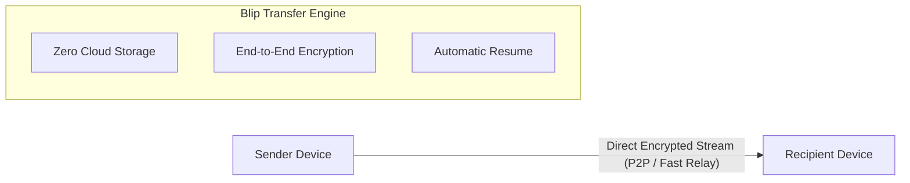

  

<h1 align="center">Blip</h1>

  <strong>Fast, direct file and folder transfer between devices — without size limits or cloud uploads.</strong>

  
  
  
  

---

## ⚡ What is Blip?

**Blip** lets you send files and folders of any size directly between your devices or to anyone across the world. There are **no cloud uploads, no storage limits, and no waiting** for uploads to complete before your recipient can start downloading.

Data streams directly from device to device in real-time, delivering multi-gigabit speeds and preserving original quality with zero compression.

---

## ✨ Key Features

- **🚀 Direct Device-to-Device Transfer**: Transfers start immediately. Your recipient downloads directly while you send — cut your transfer times in half.
- **📦 Unlimited File & Folder Sizes**: Send massive video projects, dataset archives, disk images, or whole folder trees without compression or splitting.
- **🔒 True End-to-End Encryption**: Every transfer is encrypted peer-to-peer using industry-standard TLS encryption. No cloud server ever stores or sees your files.
- **🔄 Auto-Resume & Fault Tolerant**: Lost your Wi-Fi or laptop went to sleep? Blip automatically pauses and picks up exactly where it left off once reconnected.
- **📱 Across LAN & Internet**: Works seamlessly on the same Wi-Fi network at full local speed or over long distances across the globe with smart multi-gigabit relays.
- **💻 Cross-Platform**: Native experiences for macOS, Windows, Linux, iOS, and Android.
- **🚫 Zero Ads & Privacy-First**: No ads, no tracking, and no data harvesting.

---

## 🚀 How It Works

1. **Select**: Choose any file or folder (regardless of size).
2. **Share**: Send directly to nearby devices or generate a secure, one-time transfer link/code.
3. **Stream**: The recipient begins receiving bits instantly — no waiting for a complete cloud upload!

---

## 🎨 Asset Resources

This repository includes high-resolution macOS icons located in [`assets/`](assets/):
- **macOS Icon**: [`assets/Blip_macOS.icns`](assets/Blip_macOS.icns)
- **macOS Alt Icon**: [`assets/Blip_macOS_alt.icns`](assets/Blip_macOS_alt.icns)
- **PNG Preview**: [`assets/logo.png`](assets/logo.png) & [`assets/logo_alt.png`](assets/logo_alt.png)

---

## 🛠️ Project Status

> [!NOTE]  
> Code implementation and module structures are currently being assembled. Stay tuned for the upcoming initial releases and build instructions!

---

## 📄 License

This repository is distributed under the [MIT License](LICENSE).
