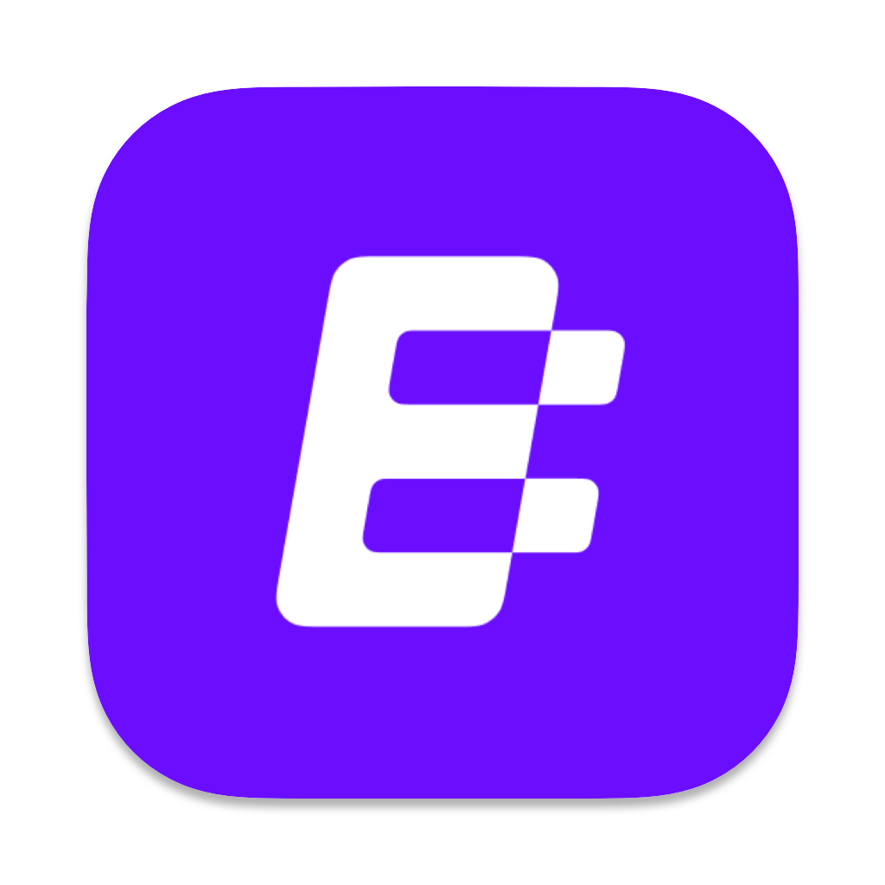
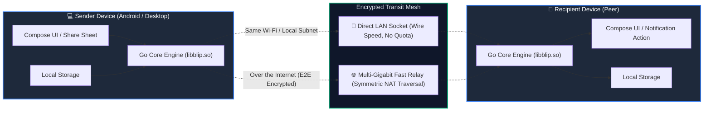
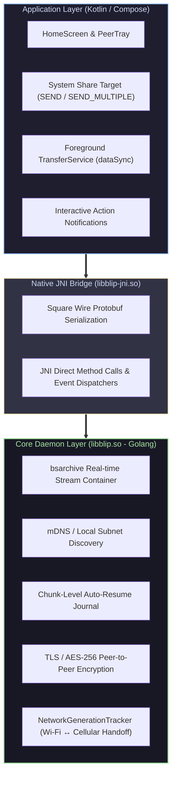
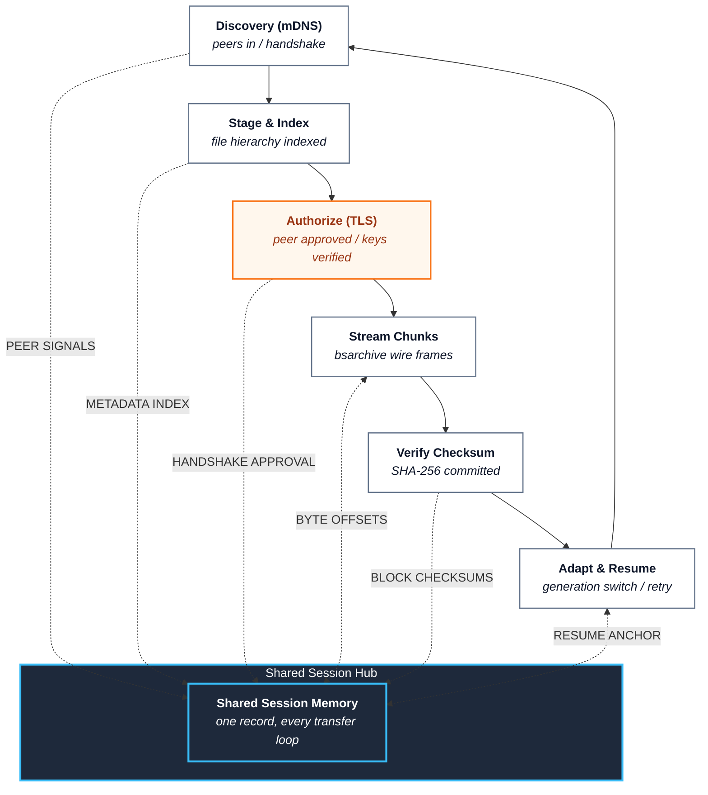
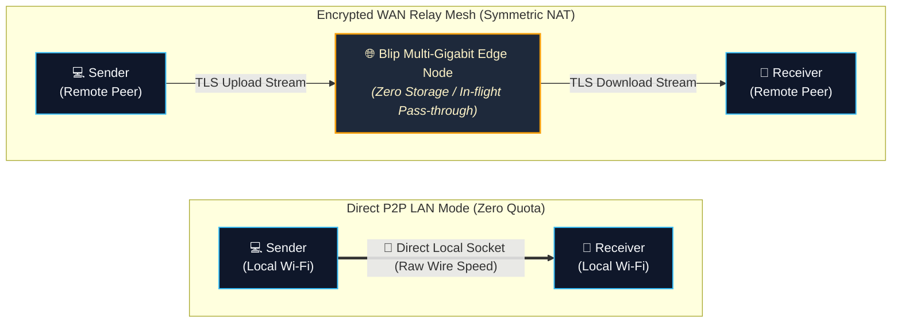

<p align="center">
  
</p>

<h1 align="center">Blip</h1>

<p align="center">
  <strong>Direct, peer-to-peer file transfer of any size — zero cloud storage, multi-gigabit speeds, and true end-to-end encryption.</strong>
</p>

<p align="center">
  <a href="https://blip.net"></a>
  <a href="LICENSE"></a>
  
  
</p>

<p align="center">
  <em>Stream original, full-resolution files and nested directory trees directly between devices without waiting for cloud uploads.</em>
</p>

---

## 💡 Why Blip?

Traditional file sharing is bound by a fundamentally broken two-step paradigm: **Upload first, wait, then download later.**

Whether relying on cloud drives or web upload services, users face file size caps, compressed media, paid tiers, and third-party storage liability. If a Wi-Fi connection drops at 99%, traditional uploads often fail completely and force you to restart from zero.

> *"The fastest transfer is the one that skips the cloud altogether."*  
> Blip eliminates the intermediary server: the recipient starts receiving bytes the exact millisecond you begin sending.

---

## ⚡ What Makes It Different (Comparative Matrix)

<table>
  <thead>
    <tr>
      <th width="50%">☁️ Traditional Cloud Sharing (WeTransfer, Drive, Dropbox)</th>
      <th width="50%">⚡ Blip Direct Protocol</th>
    </tr>
  </thead>
  <tbody>
    <tr>
      <td><b>Two-Step Latency:</b> Sender must wait 100% for upload completion before recipient can begin downloading.</td>
      <td><b>Instant Streaming:</b> Real-time streaming. Recipient downloads as you send, cutting transfer times in half.</td>
    </tr>
    <tr>
      <td><b>Strict Size Limits:</b> 2GB–5GB free caps; forces paid subscriptions for large dumps or high-res video.</td>
      <td><b>Unlimited Size:</b> 100MB or 1TB+ — files & entire folder trees transfer without compression or caps.</td>
    </tr>
    <tr>
      <td><b>Third-Party Storage:</b> Your confidential data resides on remote cloud servers and storage disks.</td>
      <td><b>Zero Cloud Storage:</b> Pure peer-to-peer. Data never sits or caches on any server.</td>
    </tr>
    <tr>
      <td><b>Fragile Failures:</b> Connection drops or laptop closing often require restarting the upload from scratch.</td>
      <td><b>Fault-Tolerant Auto-Resume:</b> Pauses if network switches or laptop closes; resumes seamlessly at the byte level.</td>
    </tr>
    <tr>
      <td><b>Lossy Compression:</b> Videos and photos are frequently re-encoded or compressed in transit.</td>
      <td><b>Bit-for-Bit Original:</b> Exact SHA-256 verified binary fidelity preserved.</td>
    </tr>
  </tbody>
</table>

---

## 🏗️ System Architecture & Data Flow

Blip operates a hybrid architecture: a high-performance **Go core daemon** (`libblip.so`) bridged via **C++ JNI** (`libblip-jni.so`) into a responsive **Jetpack Compose / Compose Multiplatform** UI.

### 1. Peer-to-Peer Transfer Topology



### 2. Protocol Engine & Streaming Stack



---

### 3. The Transfer Lifecycle Loop (Shared-Memory Flywheel)

Following the continuous feedback pattern from editorial system architectures, Blip operates an active **Session State Journal** as the shared-memory hub. Every stage in the transfer lifecycle reads from and writes back to this central journal:



---

### 4. Direct LAN vs. WAN Edge Relay Data Path



---

### 5. `bsarchive` Streaming Container Pipeline

```mermaid
flowchart LR
    subgraph SenderSide["Sender Storage Pipeline"]
        D["Deep Folder Tree / Files"] --> S["Directory Walker"]
        S --> Meta["bsarchive.Metadata (Protobuf)"]
        Meta --> Stream["Binary Chunk Stream"]
    end

    subgraph Wire["In-Flight Wire Transit"]
        Stream == "Encrypted P2P Stream" ==> Ingest["Real-time Streaming Ingest"]
    end

    subgraph ReceiverSide["Receiver Storage Pipeline"]
        Ingest --> Header["Parse Header Chunks"]
        Header --> Alloc["Reconstruct Folder Layout"]
        Alloc --> DirectWrite["Direct Disk Commit & SHA-256 Verification"]
    end

    classDef sStyle fill:#1E293B,stroke:#3B82F6,stroke-width:1.5px,color:#F8FAFC;
    classDef wStyle fill:#0F172A,stroke:#10B981,stroke-width:2px,color:#E2E8F0;
    classDef rStyle fill:#1E293B,stroke:#8B5CF6,stroke-width:1.5px,color:#F8FAFC;
    class D,S,Meta,Stream sStyle;
    class Wire,Ingest wStyle;
    class Header,Alloc,DirectWrite rStyle;
```



---

## 🎯 Core Capabilities & Feature Breakdown

<table>
<tr>
  <td width="33%" align="center">
    <h3>⚡ Multi-Gigabit Throughput</h3>
    <sub>Optimized streaming pipelines saturate local Gigabit Wi-Fi or fiber connections with zero cloud bottlenecks.</sub>
  </td>
  <td width="33%" align="center">
    <h3>📁 Folder Hierarchy Integrity</h3>
    <sub>Transfer complex folder trees, code repos, and raw media bundles intact using real-time <code>bsarchive</code> streaming.</sub>
  </td>
  <td width="33%" align="center">
    <h3>🔐 Zero-Knowledge Security</h3>
    <sub>Authenticated TLS handshakes with point-to-point AES payload encryption. Only the sender and recipient have the keys.</sub>
  </td>
</tr>
<tr>
  <td width="33%" align="center">
    <h3>🔄 Chunk Auto-Resume</h3>
    <sub>State journaling handles app switches, Wi-Fi drops, and mobile-to-cellular handoffs without losing transferred bytes.</sub>
  </td>
  <td width="33%" align="center">
    <h3>📱 Deep OS Integration</h3>
    <sub>Native Android share target, rich notification controls with progress bars, and custom audio chime cues.</sub>
  </td>
  <td width="33%" align="center">
    <h3>🚫 Ad-Free & Tracker-Free</h3>
    <sub>No advertising SDKs, zero user tracking, and no cloud caching. Built purely for privacy and speed.</sub>
  </td>
</tr>
</table>

---

## 🔍 Detailed Component Deep Dive

### 1. `bsarchive` Streaming Container
Unlike conventional zip archives that require compressing the entire directory before sending, Blip uses a custom **`bsarchive`** protocol:
- **Streaming Header**: Files and folders are streamed sequentially with real-time metadata chunks (`bsarchive.Metadata`).
- **Zero Disk Overhead**: Unpacks immediately as bytes arrive, requiring no temporary zip cache or double storage.
- **Timestamp & Permission Preservation**: Preserves original modification timestamps and directory structures across platforms.

### 2. Uninterrupted Background Service (`TransferService`)
- Runs as an active Android Foreground Service with `foregroundServiceType="dataSync"`.
- Coupled with AndroidX `WorkManager` (`TransferWorker`) to ensure the OS never kills long-running transfers during screen-off states.
- Listens to system network connectivity switches via `NetworkGenerationTracker`.

### 3. Interactive Notification Action Tray
- Accept or decline incoming transfer requests directly from the status bar without switching apps.
- Live-updating notification bar displaying speed (MB/s), remaining ETA, and byte counters.
- Built-in audio cues: `incoming.wav`, `outgoing.wav`, `complete.wav`, and `failure.wav`.

### 4. Built-in Media Gallery & Hardware Recognition
- **Gallery Viewer**: Full-screen preview with pinch-to-zoom (`ZoomableImage`) and embedded **AndroidX Media3 ExoPlayer** (`GalleryVideoPlayer`).
- **Hardware Device Recognition**: Bundled with `android-devices.db` (1.4 MB SQLite database) to map technical hardware identifiers (e.g., `SM-S928B`) to friendly names like *"Samsung Galaxy S24 Ultra"*.

---

## 📁 Repository Structure

```text
Blip/
├── android-app/                 <-- Main Android Studio project (Gradle, Kotlin/Compose)
│   ├── app/
│   │   ├── src/main/
│   │   │   ├── AndroidManifest.xml   <-- Android Application Manifest
│   │   │   ├── java/                 <-- 853 Java & Kotlin source files
│   │   │   ├── res/                  <-- 709 XML layouts, drawables, strings, audio
│   │   │   ├── assets/               <-- android-devices.db & composeResources
│   │   │   └── jniLibs/arm64-v8a/    <-- libblip.so (Go core), libblip-jni.so, libsentry
│   │   ├── build.gradle.kts          <-- App dependencies & build scripts
│   │   ├── google-services.json      <-- Firebase / Google Services config
│   │   └── proguard-rules.pro        <-- ProGuard keep rules
│   ├── build.gradle.kts              <-- Project build configuration
│   ├── settings.gradle.kts           <-- Module and repository definitions
│   └── gradle.properties             <-- Memory and JVM options
│
├── source/                      <-- Complete decompiled application sources
├── smali/                       <-- Smali disassembly bytecode (11,046 files)
├── resources/                   <-- Application XML resources and graphics
├── app-assets/                  <-- Bundled application assets & databases
├── native-libs/                 <-- ARM64 compiled native engine libraries (.so)
├── dex/                         <-- Base classes.dex bytecode
├── build-packages/              <-- Distribution APK split builds and configurations
├── third-party/                 <-- Third-party library manifests and licenses
│
├── assets/                      <-- High-Resolution App Icons & Branding Assets
│   ├── Blip_macOS.icns          <-- macOS App Icon (Big Sur – Sequoia)
│   ├── Blip_macOS_alt.icns      <-- macOS Alt App Icon
│   ├── logo.png                 <-- High-res raster branding logo
│   └── logo_alt.png             <-- Alternative raster branding logo
│
├── documentation/               <-- Comprehensive Architecture & Protocol Specs
│   ├── ARCHITECTURE.md          <-- CMP + JNI + Go core architecture guide
│   ├── PROTOBUF_SPECIFICATIONS.md <-- Protobuf schemas for bsarchive, State, and Events
│   ├── NATIVE_COMPONENTS.md     <-- JNI function exports and Go package mapping
│   ├── UI_NAVIGATION.md         <-- Route table and Compose NavHost screen breakdown
│   ├── BUILD_REPORT.md          <-- Build configuration and component report
│   ├── COMPONENTS.md            <-- Application modules and service catalog
│   └── LIMITATIONS.md           <-- Architecture and technical notes
│
└── README.md                    <-- Project guide
```

---

## 🛠️ Technical Specifications (Android Client)

| Property | Details |
| :--- | :--- |
| **Application ID** | `net.blip.android` |
| **Version** | `1.2.3` (Version Code: `10203000`) |
| **SDK Compatibility** | Min SDK: `28` (Android 9.0) \| Target SDK: `36` \| Compile SDK: `37` |
| **UI Framework** | Jetpack Compose + Compose Multiplatform runtime (`1.12.0`) |
| **Native Daemon Core** | Go (Golang v1.26.7) in `libblip.so` via `libblip-jni.so` (C++ NDK) |
| **Serialization Protocol**| Square Wire Protobuf (`com.squareup.wire:wire-runtime:4.9.9`) |
| **Media Engine** | AndroidX Media3 ExoPlayer (`1.4.1`) |
| **Image Loading** | Coil 3 (`io.coil-kt.coil3:coil-compose:3.0.0-rc01`) |
| **File Picker** | FileKit (`io.github.vinceglb:filekit:0.8.7`) |
| **Device Intelligence** | SQLite database `android-devices.db` (1.4 MB) |

---

## 🎨 Asset Resources

This repository includes high-resolution assets located in [`assets/`](assets/):
- **macOS Icon**: [`assets/Blip_macOS.icns`](assets/Blip_macOS.icns)
- **macOS Alt Icon**: [`assets/Blip_macOS_alt.icns`](assets/Blip_macOS_alt.icns)
- **PNG Preview**: [`assets/logo.png`](assets/logo.png) & [`assets/logo_alt.png`](assets/logo_alt.png)

---

## 🚀 Building & Running the Project

1. Launch **Android Studio** (Giraffe / Hedgehog or newer recommended).
2. Click **Open** and select the [`android-app/`](android-app/) folder.
3. Verify that **JDK 17** is configured in Gradle settings.
4. Sync Gradle dependencies.
5. Deploy to any physical Android device or emulator running **`arm64-v8a`** architecture.

---

## 📄 License

Distributed under the [MIT License](LICENSE). Copyright &copy; 2026 [Arafath Rahman](https://github.com/smartworldarafath).
