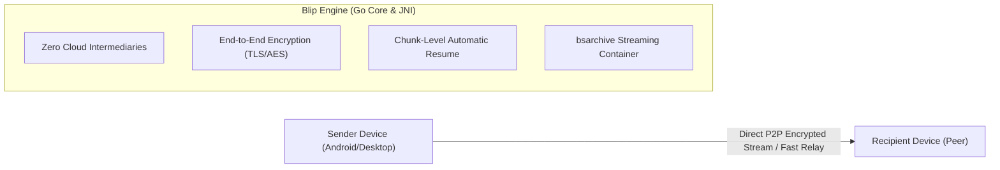

<p align="center">
  
</p>

<h1 align="center">Blip</h1>

<p align="center">
  <strong>Fast, direct file and folder transfer between devices — without size limits or cloud uploads.</strong>
</p>

<p align="center">
  <a href="https://blip.net"></a>
  <a href="LICENSE"></a>
  
  
</p>

---

## ⚡ What is Blip?

**Blip** lets you send files and folders of any size directly between your devices or to anyone across the world. There are **no cloud uploads, no intermediary storage limits, and no waiting** for uploads to finish before your recipient can start downloading.

Data streams directly from device to device in real-time, delivering multi-gigabit speeds and preserving original quality with zero compression.

---

## 🚀 How It Works



---

## ✨ Comprehensive Features & Functionalities

### 1. ⚡ Peer-to-Peer Direct Streaming Transfer
- **Direct P2P & Smart Relay Transport**: Automatically discovers devices on the same local Wi-Fi/LAN network for maximum multi-gigabit local throughput. When devices are behind symmetric NATs or across different networks, transfers gracefully route through high-throughput end-to-end encrypted relay nodes.
- **Zero Cloud Storage**: Files are never cached, stored, or indexed on cloud servers. The recipient streams directly from the sender's disk in real-time.
- **No File Size or Folder Limits**: Transfer everything from gigabyte-sized raw 4K/8K video footage, large software disk images, multi-terabyte dataset archives, to nested folder trees with thousands of files without tar/zip pre-compression.
- **`bsarchive` Real-Time Container Protocol**: Folders and file batches are packaged and unpacked on-the-fly using the custom `bsarchive` Protobuf protocol (`bsarchive.Metadata`), computing streaming checksums and preserving directory structures and modification timestamps.

### 2. 🛡️ Security, Privacy & Cryptographic Verification
- **True End-to-End Encryption (E2EE)**: Every transfer session is negotiated with cryptographically secure handshakes and encrypted point-to-point via TLS/AES. Even signaling servers cannot decrypt payload data.
- **SHA-256 Bit-Level Integrity**: All items transferred are hashed with SHA-256 to ensure zero corruption or packet tampering during transfer.
- **Privacy-First (No Ads, No Tracking)**: No marketing trackers, no advertising SDKs, and zero telemetry on user data or file contents.

### 3. 🔄 Fault Tolerance & Chunk-Level Auto-Resume
- **Automatic Disconnect Recovery**: If Wi-Fi drops, the device switches from Wi-Fi to cellular data, or the screen locks, the transfer automatically pauses and resumes from the exact byte offset once the network is restored.
- **Network Generation Tracking**: The Android client includes an active `NetworkGenerationTracker` that monitors OS connectivity shifts (Wi-Fi, 4G/5G, Ethernet) and triggers auto-reconnect signals to the Go daemon.

### 4. 📱 Android OS Deep Integration & User Experience
- **System Share Target (SEND & SEND_MULTIPLE)**: Share directly to Blip from Google Photos, Files by Google, Gallery, YouTube, browsers, or any app via the native Android Share Sheet (`*/*` MIME types supported).
- **Interactive Action Notifications**:
  - Accept or decline incoming transfers directly from the notification tray without opening the app (`TransferNotificationBroadcastReceiver`).
  - Real-time progress bar showing transfer speed, percentage, remaining time, and transferred bytes.
  - Distinct auditory feedback chimes: `incoming.wav` (new transfer), `outgoing.wav` (transfer started), `complete.wav` (transfer finished), and `failure.wav` (error alert).
- **Uninterrupted Foreground Service (`dataSync`)**: Utilizes `TransferService` with `foregroundServiceType="dataSync"` and `TransferWorker` (WorkManager) to guarantee transfers continue smoothly in the background without being killed by Android battery optimization.
- **Deep Linking & Web Handoff**: Handles `https://blip.net/*@*` deep links and `.url` internet shortcuts (`InternetShortcutActivity`) to instantly initiate transfer sessions from web links or QR codes.
- **Hardware Device Recognition**: Integrates `android-devices.db` (1.4 MB embedded SQLite database) to map technical device model identifiers (e.g., `SM-S928B`, `Pixel 8 Pro`) into clear, human-readable names in the UI.

### 5. 🎨 Modern Jetpack Compose UI & Built-in Tools
- **Home Dashboard (`HomeScreen`)**:
  - **Peer Tray (`PeerTray`)**: Carousel of nearby discovered devices and active peers with avatar badges and online indicators.
  - **Transfer Grid (`TransferGrid`)**: Card view of active, paused, completed, and received transfers with one-tap inspection, cancellation, and cleanup dialogs.
- **Full-Featured Onboarding (`OnboardingStepper`)**: Clean multi-step registration workflow with email verification, numeric OTP code entry (`OTPCodeVisualTransformation`), notification permission priming, and companion device pairing.
- **Built-in Media Gallery (`GalleryScreen`)**:
  - Full-screen image preview with pinch-to-zoom and pan gestures (`ZoomableImage`).
  - Integrated video player powered by **AndroidX Media3 ExoPlayer** (`GalleryVideoPlayer`) with custom scrubbers and controls.
- **Audio Picker (`AudioPickerScreen`)**: Dedicated in-app audio selection sheet for searching and queuing audio files.
- **Dynamic Theming**: Fluid dark and light theme switching with custom rounded surfaces (`AbsoluteSmoothCornerShape`).

---

## 📁 Repository Structure

```text
Blip/
├── android-app/                 <-- Editable Android Studio project
│   ├── app/
│   │   ├── src/main/
│   │   │   ├── AndroidManifest.xml   <-- Cleaned AndroidManifest
│   │   │   ├── java/                 <-- 853 reconstructed Java/Kotlin source files
│   │   │   ├── res/                  <-- 709 merged XML layouts, drawables, strings, audio
│   │   │   ├── assets/               <-- android-devices.db & composeResources
│   │   │   └── jniLibs/arm64-v8a/    <-- libblip.so (Go core), libblip-jni.so, libsentry
│   │   ├── build.gradle.kts          <-- Configured dependencies, plugins, and compile flags
│   │   ├── google-services.json      <-- Reconstructed Firebase / Google Services config
│   │   └── proguard-rules.pro        <-- Retained keep rules
│   ├── build.gradle.kts              <-- Project build configuration
│   ├── settings.gradle.kts           <-- Module and repository definitions
│   └── gradle.properties             <-- Memory and JVM options
│
├── source/                      <-- Full JADX decompilation (sources and resources)
├── smali/                       <-- Full Smali disassembly (11,046 files)
├── resources/                   <-- Merged resources from base & split APKs
├── app-assets/                  <-- Assets extracted from the APKs
├── native-libs/                 <-- Extracted ARM64 native binaries (.so)
├── dex/                         <-- Extracted classes.dex
├── xapk-analysis/               <-- Extracted APKs & Apktool decoding directories
├── third-party/                 <-- Library version manifests (.version, .properties, .proto)
│
├── documentation/
│   ├── ARCHITECTURE.md          <-- Hybrid CMP + JNI + Go core architecture
│   ├── PROTOBUF_SPECIFICATIONS.md <-- Protobuf schemas for bsarchive, State, and Events
│   ├── NATIVE_COMPONENTS.md     <-- JNI function exports and Go package mapping
│   └── UI_NAVIGATION.md         <-- Route table and Compose NavHost screen breakdown
│
├── RECOVERY_REPORT.md           <-- Detailed recovery report
├── RECOVERED_COMPONENTS.md      <-- Discrete component catalog
├── UNRECOVERABLE_COMPONENTS.md  <-- Technical limitations and unrecoverable elements
└── README.md                    <-- Project guide
```

---

## 🛠️ Technical Specifications (Android Client)

- **Package**: `net.blip.android`
- **Version**: 1.2.3 (Version Code: `10203000`)
- **Min SDK**: 28 (Android 9.0 Pie) \| **Target SDK**: 36 \| **Compile SDK**: 37
- **UI Framework**: Jetpack Compose + Compose Multiplatform runtime (`1.12.0`)
- **Serialization**: Square Wire Protobuf (`com.squareup.wire:wire-runtime:4.9.9`)
- **Native Backend**: Go (Golang v1.26.7) in `libblip.so` bridged via `libblip-jni.so` (C++ NDK)
- **Firebase**: Push notifications (FCM), Project ID `blip-net`
- **Local Database**: SQLite `android-devices.db` (1.4 MB)
- **Media Playback**: AndroidX Media3 ExoPlayer (`androidx.media3:media3-exoplayer:1.4.1`)
- **Image Loader**: Coil 3 (`io.coil-kt.coil3:coil-compose:3.0.0-rc01`)
- **File Picker**: FileKit (`io.github.vinceglb:filekit:0.8.7`)

---

## 🎨 Asset Resources

This repository includes high-resolution icons located in [`assets/`](assets/):
- **macOS Icon**: [`assets/Blip_macOS.icns`](assets/Blip_macOS.icns)
- **macOS Alt Icon**: [`assets/Blip_macOS_alt.icns`](assets/Blip_macOS_alt.icns)
- **PNG Preview**: [`assets/logo.png`](assets/logo.png) & [`assets/logo_alt.png`](assets/logo_alt.png)

---

## 🚀 Getting Started with the Project

1. Open **Android Studio** (Giraffe or newer recommended).
2. Choose **Open an Existing Project** and navigate to `android-app/`.
3. Allow Gradle to sync dependencies (requires JDK 17).
4. Run or assemble the app on an `arm64-v8a` device or emulator.

---

## 📄 License

This repository is distributed under the [MIT License](LICENSE).

