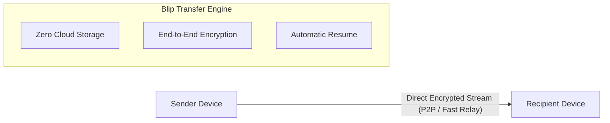

<p align="center">
  
</p>

<h1 align="center">Blip</h1>

<p align="center">
  <strong>Fast, direct file and folder transfer between devices — without size limits or cloud uploads.</strong>
</p>

<p align="center">
  <a href="https://blip.net"></a>
  <a href="LICENSE"></a>
  
  
</p>

---

## ⚡ What is Blip?

**Blip** lets you send files and folders of any size directly between your devices or to anyone across the world. There are **no cloud uploads, no storage limits, and no waiting** for uploads to complete before your recipient can start downloading.

Data streams directly from device to device in real-time, delivering multi-gigabit speeds and preserving original quality with zero compression.

---

## ✨ Key Features

- **🚀 Direct Device-to-Device Transfer**: Transfers start immediately. Your recipient downloads directly while you send — cut your transfer times in half.
- **📦 Unlimited File & Folder Sizes**: Send massive video projects, dataset archives, disk images, or whole folder trees without compression or splitting.
- **🔒 True End-to-End Encryption**: Every transfer is encrypted peer-to-peer using industry-standard TLS encryption. No cloud server ever stores or sees your files.
- **🔄 Auto-Resume & Fault Tolerant**: Lost your Wi-Fi or laptop went to sleep? Blip automatically pauses and picks up exactly where it left off once reconnected.
- **📱 Across LAN & Internet**: Works seamlessly on the same Wi-Fi network at full local speed or over long distances across the globe with smart multi-gigabit relays.
- **💻 Cross-Platform**: Native experiences for macOS, Windows, Linux, iOS, and Android.
- **🚫 Zero Ads & Privacy-First**: No ads, no tracking, and no data harvesting.

---

## 🚀 How It Works



---

## 📁 Repository Structure

```text
Blip/
├── recovered-project/           <-- Editable Android Studio project
│   ├── app/
│   │   ├── src/main/
│   │   │   ├── AndroidManifest.xml   <-- Cleaned AndroidManifest
│   │   │   ├── java/                 <-- 853 reconstructed Java/Kotlin source files
│   │   │   ├── res/                  <-- 709 merged XML layouts, drawables, strings, audio
│   │   │   ├── assets/               <-- android-devices.db & composeResources
│   │   │   └── jniLibs/arm64-v8a/    <-- libblip.so (Go core), libblip-jni.so, libsentry
│   │   ├── build.gradle.kts          <-- Configured dependencies, plugins, and compile flags
│   │   ├── google-services.json      <-- Reconstructed Firebase / Google Services config
│   │   └── proguard-rules.pro        <-- Retained keep rules
│   ├── build.gradle.kts              <-- Project build configuration
│   ├── settings.gradle.kts           <-- Module and repository definitions
│   └── gradle.properties             <-- Memory and JVM options
│
├── recovered-source/            <-- Full JADX decompilation (sources and resources)
├── recovered-smali/             <-- Full Smali disassembly (11,046 files)
├── recovered-resources/         <-- Merged resources from base & split APKs
├── recovered-assets/            <-- Assets extracted from the APKs
├── recovered-native/            <-- Extracted ARM64 native binaries (.so)
├── recovered-dex/               <-- Extracted classes.dex
├── original-xapk-analysis/      <-- Extracted APKs & Apktool decoding directories
├── third-party/                 <-- Library version manifests (.version, .properties, .proto)
│
├── documentation/
│   ├── ARCHITECTURE.md          <-- Hybrid CMP + JNI + Go core architecture
│   ├── PROTOBUF_SPECIFICATIONS.md <-- Protobuf schemas for bsarchive, State, and Events
│   ├── NATIVE_COMPONENTS.md     <-- JNI function exports and Go package mapping
│   └── UI_NAVIGATION.md         <-- Route table and Compose NavHost screen breakdown
│
├── RECOVERY_REPORT.md           <-- Detailed recovery report
├── RECOVERED_COMPONENTS.md      <-- Discrete component catalog
├── UNRECOVERABLE_COMPONENTS.md  <-- Technical limitations and unrecoverable elements
└── README.md                    <-- Project guide
```

---

## 🛠️ Technical Specifications (Android Client)

- **Package**: `net.blip.android`
- **Version**: 1.2.3 (Code: `10203000`)
- **Min SDK**: 28 (Android 9.0) \| **Target SDK**: 36 \| **Compile SDK**: 37
- **UI Framework**: Jetpack Compose + Compose Multiplatform runtime (`1.12.0`)
- **Serialization**: Square Wire Protobuf (`com.squareup.wire:wire-runtime:4.9.9`)
- **Native Backend**: Go (Golang v1.26.7) in `libblip.so` bridged via `libblip-jni.so`
- **Firebase**: Push notifications (FCM), Project ID `blip-net`
- **Local Database**: SQLite `android-devices.db` (1.4 MB)
- **Media Playback**: AndroidX Media3 ExoPlayer (`androidx.media3`)
- **Image Loader**: Coil 3 (`io.coil-kt.coil3`)

---

## 🎨 Asset Resources

This repository includes high-resolution macOS icons located in [`assets/`](assets/):
- **macOS Icon**: [`assets/Blip_macOS.icns`](assets/Blip_macOS.icns)
- **macOS Alt Icon**: [`assets/Blip_macOS_alt.icns`](assets/Blip_macOS_alt.icns)
- **PNG Preview**: [`assets/logo.png`](assets/logo.png) & [`assets/logo_alt.png`](assets/logo_alt.png)

---

## 🚀 Getting Started with the Project

1. Open **Android Studio** (Giraffe or newer recommended).
2. Choose **Open an Existing Project** and navigate to `recovered-project/`.
3. Allow Gradle to sync dependencies (requires JDK 17).
4. Run or assemble the app on an `arm64-v8a` device or emulator.

---

## 📄 License

This repository is distributed under the [MIT License](LICENSE).
